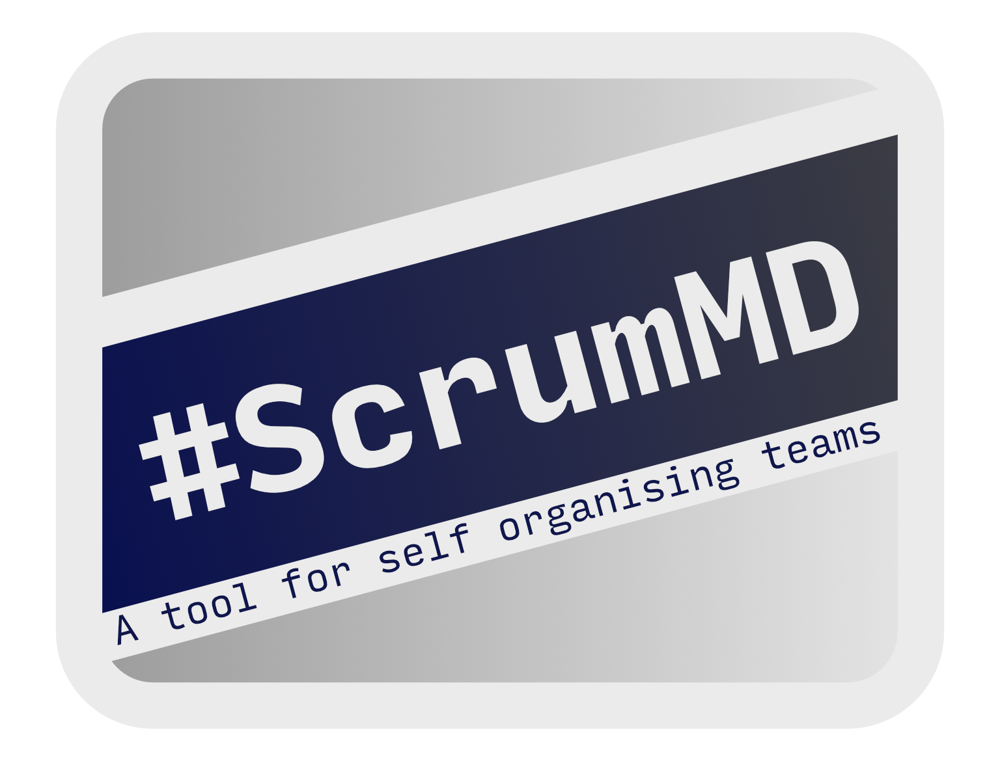

## ScrumMD



**ScrumMD** started with a question: What if we could have a scrum board driven entirely by md files and the CLI, and use it with git?

I know that it's going to be of niche use, but it opens up a number of great ways to do the scrum process. For instance:

-   You can run standup for `sprint1` with:

```bash
vim `sbl -b sprint1`
```

-   You can manage your cards with git...
-   ... and can add them in the repository that they are for
-   It's all text - so integrate with whatever you want

The very basics are that you have a `scrum` folder, and you can put cards inside
it. A card is very simple - it's just a markdown file with at least a summary
field. For instance -

```markdown
---
Summary: Make the thing
---

# Description

Take the steps to make the thing

# Dependencies

-   [[thing02]]
-   [[thing03]]
```

would be a completely valid card that can be explored with ScrumMD. But - per
the documentation - it does a bunch more!

## Documentation

Find it all over on [Read The Docs](https://scrummd.readthedocs.io/). There's a fair bit of detail, and a tutorial for getting started.

## License

This is published under the [GNU General Public License v3.0](LICENSE.md). I am willing to discuss making it available under another license, or providing pai
