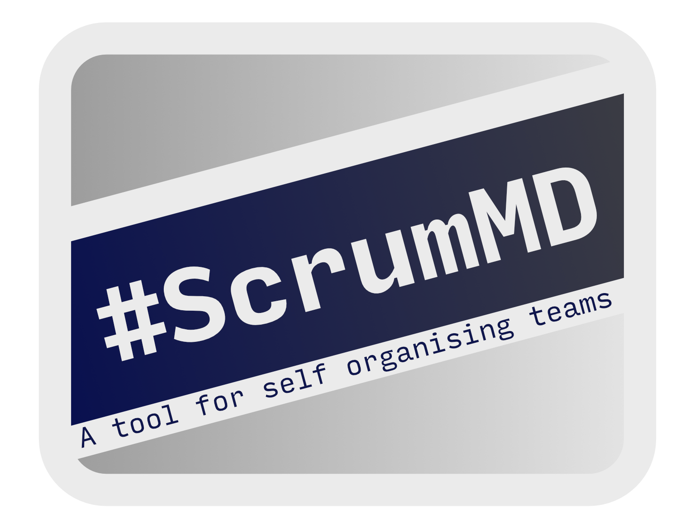

.. ScrumMD documentation master file, created by
   sphinx-quickstart on Sat Mar  9 12:49:29 2024.
   You can adapt this file completely to your liking, but it should at least
   contain the root `toctree` directive.

ScrumMD |version|
===================================

Welcome to the documentation for ScrumMD.

**ScrumMD** has tools for self-organising teams to manage cards written in
markdown.  As the name suggests, it was originally designed for teams to use in
the Scrum process, but it can also be used for:

- Kanban style processes
- Tracking bugs and issues
- Tracking decisions or questions

It still has room to grow, but the fundamental tools are there to use it.
:ref:`getting-started` shows you how to use it, and offers suggestions about how
to create a workflow around it.

The CLI commands and library are documented here. It is recommended that you use
the library with Python if you're wanting to automate parts of the process
rather than relying on the output of the CLI commands.

.. toctree::
   :maxdepth: 2
   :caption: Contents:

   getting_started
   commands/commands 
   card
   configuration
   source/scrummd
   semver

Indices and tables
==================

* :ref:`genindex`
* :ref:`modindex`
* :ref:`search`
